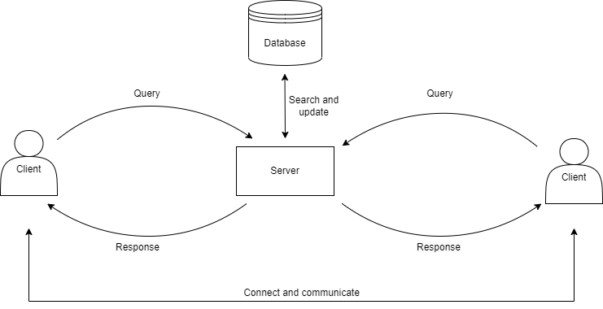

# CN-Lab-Assignment
# Chat application

It is a hybrid chat application between client-server and peer-to-peer (P2P). 

* Client-Server :
    * **Accounts registration** 
    Users can create new account by make a registration or simple login into the network using their account
    * **Login and Logout** 
    When a user logs in, the server will saves their ip address and port number into database and this entry stays in the database until the user logs out or disconnected from the network. Whenever a login request is sent to the server, a message will be sent from the client-side to the server-side to notificate that they have made a connection.
    * **Search** 
    A user can search another online user using that user's username to retrieve the ip address and the port number of the users who are currently active
* P2P:
    * **Add friend** 
    A user can send an add-friend request to others. Client can only chat when they already have been friend.
    * **Chat** 
    When a user wants to chat with another user, a chat request is sent to the other user. If that user accept the request, the conversation could begin and vice versa.
    * **Chat all** 
    A user can also send a message to all of the clients who are currently active and chat-request-accepted in the network
     * **Send file** 
    User can also sending file to others. The file received will be displayed in format [filename]:[file content]
    

## How to Use It?
* Clone the repo.
* Run 'server.py'.
* Run 'main.py'.
* Chat!
